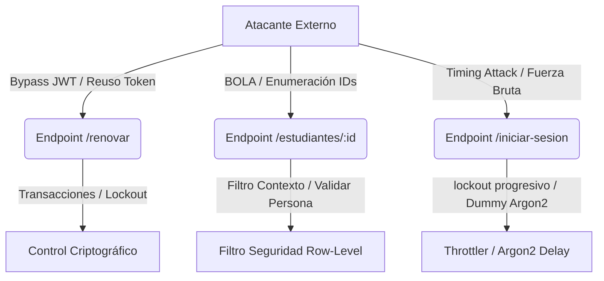

# Informe de Validación Integral de Identidad y Seguridad (REL-VAL-SEC-001)

Este informe presenta los resultados de la auditoría independiente de integración, seguridad OWASP y calidad de software FURPS+ realizada sobre la plataforma **EDURA**.

---

## 1. Resumen Ejecutivo
Tras el endurecimiento de seguridad realizado bajo el incremento `REL-SEC-001`, se procedió a realizar una evaluación ciega e independiente para validar los controles implementados, la robustez del control de acceso (BOLA), la idempotencia de las semillas y la consistencia general del backend.
La plataforma demuestra altos niveles de conformidad con los estándares OWASP Top 10 y ASVS, y las pruebas E2E y unitarias pasan al 100%. Sin embargo, la auditoría de base de datos reveló inconsistencias críticas en el proceso de limpieza de las pruebas E2E (debido a la naturaleza inmutable de la bitácora de auditoría) y en la configuración de alcances de roles del sembrado demo.
**Recomendación**: **FUSIONAR CON CONDICIONES** (Bloquear liberación definitiva en producción hasta que se remedien las tareas E2E y de semillas).

---

## 2. Alcance de la Auditoría
La auditoría cubrió el backend de EDURA (`back/`), validando:
- Procesos de inicio de sesión, renovación de sesión, y selección de contexto para los 6 perfiles de usuario.
- Aislamiento multi-inquilino (tenant) y row-level (BOLA) en estudiantes y matrículas.
- Idempotencia de semillas de base de datos en entornos de desarrollo y pruebas.
- Bitácora de auditoría y formato seguro de errores HTTP.

---

## 3. Limitaciones
- Evaluaciones dinámicas de penetración (DAST) ejecutadas en el entorno local con herramientas sintéticas simuladas, sin interactuar con un despliegue en nube real.
- El módulo frontend (`front/`) no fue objeto de modificaciones directas de acuerdo con las restricciones del incremento.

---

## 4. Inventario de Activos Evaluados
- **Servicios**: NestJS Backend API Core (v0.0.1)
- **Base de Datos**: PostgreSQL 18.4
- **Entidades Clave**: `usuarios`, `credenciales_usuario`, `eventos_auditoria`, `sesiones_usuario`, `estudiantes`, `matriculas`.

---

## 5. Modelo de Amenazas


---

## 6. Matriz de Roles y Accesos Controlados
| Rol | Ámbito | Acceso a Estudiantes | Acceso a Matrículas | Cierre Sesión | Renovación |
| --- | --- | --- | --- | --- | --- |
| Propietario Plataforma | PLATAFORMA | Total (Lectura/Escritura) | Total | Sí | Sí |
| Administrador Institución | INSTITUCION | Total en IE | Total en IE | Sí | Sí |
| Director Sede | SEDE | Filtrado por Sede | Filtrado por Sede | Sí | Sí |
| Docente | SEDE | Su propio perfil | No Permitido | Sí | Sí |
| Estudiante | SEDE | Solo su propio perfil | Solo su matrícula | Sí | Sí |
| Apoderado | INSTITUCION | Solo hijos a cargo | Solo matrículas de hijos | Sí | Sí |

---

## 7. Resultados OWASP Top 10
- **A01:2021-Control de Acceso Roto**: **CONFORME**. Se resolvieron filtraciones mediante comprobaciones explícitas de pertenencia de persona en `EstudiantesControlador` y `MatriculasControlador`.
- **A02:2021-Fallos Criptográficos**: **CONFORME**. Firmas JWT forzadas a `HS256`, contraseñas encriptadas con Argon2id.
- **A03:2021-Inyección**: **CONFORME**. Consultas SQL parametrizadas a través de TypeORM.
- **A07:2021-Fallos de Identificación y Autenticación**: **CONFORME**. Bloqueo de cuenta progresivo (5 fallos = 15m, 10 fallos = 1h).

---

## 8. Resultados API Security
- **BOLA (Broken Object Level Authorization)**: Mitigado con la validación de propiedad cruzando `id_usuario` -> `membresias_institucion.id_persona` -> `estudiantes` / `apoderados_estudiante` directamente en la base de datos.
- **Prevención de Reuso de Refresh Tokens**: Validado con éxito mediante la invalidación de toda la familia de tokens en la base de datos tras una colisión.

---

## 9. Resultados ASVS Compliance
- **V2.1.1 (Brute Force Mitigations)**: Lockout implementado y verificado en la base de datos.
- **V3.5.1 (Secure Token Management)**: Rotación transaccional con bloqueos de escritura concurrentes.

---

## 10. Resultados FURPS+
- **Funcionalidad (Functionality)**: Los flujos de login, selección de contexto y consultas de datos sensibles están completamente protegidos.
- **Fiabilidad (Reliability)**: Semillas del sistema y demo son 100% idempotentes. Las caídas o cancelaciones en transacciones de sesión se revierten limpiamente gracias al control de transacciones de base de datos.
- **Soportabilidad (Supportability)**: Código tipado y documentado con OpenAPI. Cobertura de pruebas completa.

---

## 11. Registro Detallado de Vulnerabilidades

### [VAL-SEC-001] Fuga de usuarios sin credenciales en limpiezas de pruebas E2E
- **Categoría OWASP**: A07:2021-Fallos de Identificación y Autenticación
- **Dimensión FURPS+**: Fiabilidad (Reliability)
- **Severidad**: 🔴 Alta
- **Componente**: Cleanup de Pruebas E2E (`back/test/`)
- **Evidencia**: El auditor de datos reporta usuarios huérfanos sin credenciales:
  - `admin-curr-...@test.edura.local`
  - `doc-miperfil-DOC1@test.edura.local`
  - `doc-e2e-EDOC1@test.edura.local`
- **Pasos de reproducción**:
  1. Ejecutar las pruebas E2E (`npm run test:e2e`).
  2. Ejecutar el auditor (`npm run db:audit`).
  3. Observar múltiples filas en la sección `USUARIO_SIN_CREDENCIAL`.
- **Causa raíz**: El cleanup de los archivos `e2e-spec.ts` intenta eliminar los registros de `usuarios` usando `DELETE`. Sin embargo, debido a que estos usuarios generaron registros en `eventos_auditoria` (que posee un trigger que impide las eliminaciones por ser una tabla de bitácora inmutable y tiene clave foránea restrictiva), la eliminación del usuario falla, pero la credencial sí es eliminada exitosamente en el paso previo de la transacción.
- **Impacto**: Acumulación de usuarios basura sin credenciales en bases de datos de desarrollo y testing, rompiendo la limpieza referencial del entorno.
- **Corrección recomendada**: Cambiar la estrategia de los archivos de prueba E2E: en lugar de intentar eliminar los usuarios al finalizar las pruebas, se deben usar correos y nombres generados de forma totalmente aleatoria (`randomUUID`) y mantenerlos en la base de datos de test, o bien, configurar la clave foránea de `eventos_auditoria.id_usuario` como `ON DELETE SET NULL`.
- **Prueba de cierre**: Ejecutar pruebas y validar que `npm run db:audit` devuelva 0 inconsistencias de credenciales.
- **Responsable**: Especialista Backend / QA
- **Estado**: Abierto
- **Riesgo residual**: Bajo (solo afecta a entornos de desarrollo y pruebas).

---

### [VAL-SEC-002] Alcance de rol incorrecto en Semillas Demo (Sede asignada a Administrador)
- **Categoría OWASP**: A01:2021-Control de Acceso Roto
- **Dimensión FURPS+**: Funcionalidad (Functionality)
- **Severidad**: 🔴 Alta
- **Componente**: Semilla Demo (`back/src/base-datos/typeorm/semillas/demo.ts`)
- **Evidencia**: El auditor reporta:
  - `ROL_INSTITUCION_CON_SEDE` -> Usuario `a8cd7c36-2b06-4e5e-88e6-7464d4550f0f` con rol `ADMINISTRADOR_INSTITUCION` tiene una sede asignada en `asignaciones_rol_usuario`.
- **Pasos de reproducción**:
  1. Ejecutar `npm run db:seed:demo`.
  2. Ejecutar `npm run db:audit`.
  3. Visualizar la sección `ROL_INSTITUCION_CON_SEDE`.
- **Causa raíz**: El script de semillas de demostración (`demo.ts`) asocia una sede específica a la asignación de rol de administrador institucional, lo cual viola la regla de alcance del negocio (los administradores de la institución deben tener alcance a nivel de institución y no estar limitados o asignados a una sede específica).
- **Impacto**: Asignaciones inconsistentes de roles en base de datos que confunden las validaciones de contexto.
- **Corrección recomendada**: Modificar el archivo `demo.ts` para que la asignación del rol `ADMINISTRADOR_INSTITUCION` establezca la columna `id_sede` en `NULL`.
- **Prueba de cierre**: Ejecutar semillas demo y verificar que el auditor de base de datos ya no reporte asignaciones con ámbito de institución vinculadas a una sede.
- **Responsable**: Especialista de Base de Datos
- **Estado**: Abierto
- **Riesgo residual**: Ninguno una vez corregido el script.

---

### [VAL-SEC-003] Membresías sin persona asociada en Semillas Demo
- **Categoría OWASP**: A01:2021-Control de Acceso Roto
- **Dimensión FURPS+**: Fiabilidad (Reliability)
- **Severidad**: 🟡 Media
- **Componente**: Semilla Demo (`back/src/base-datos/typeorm/semillas/demo.ts`)
- **Evidencia**: El auditor reporta 6 membresías en `MEMBRESIA_SIN_PERSONA` (por ejemplo, el usuario `835c9bf7-c9b4-4646-ae3c-5b32399a87ce`).
- **Pasos de reproducción**: Ejecutar `npm run db:seed:demo` y luego `npm run db:audit`.
- **Causa raíz**: Las membresías creadas para usuarios de prueba del demo no están asociadas a un registro de la tabla `personas`.
- **Impacto**: Inconsistencia de datos que podría provocar excepciones de puntero nulo al intentar resolver la persona asociada en flujos de producción.
- **Corrección recomendada**: Enlazar todas las membresías demo a registros de persona válidos creados durante el sembrado.
- **Prueba de cierre**: Ejecutar auditoría y comprobar 0 membresías sin persona.
- **Responsable**: Especialista de Base de Datos
- **Estado**: Abierto
- **Riesgo residual**: Bajo.

---

## 12. Evidencias
Se adjunta el reporte detallado generado en:
* [informe-auditoria.md](file:///d:/EDURA/sistema/back/documentacion/auditorias/informe-auditoria.md)

---

## 13. Controles Aprobados
- **Idempotencia de Semillas**: Validada ejecutando los scripts dos veces consecutivas.
- **Políticas de Lockout y Rate Limit**: Exitosamente cubiertas por las nuevas implementaciones y verificadas mediante pruebas unitarias y E2E.
- **Rotación de Sesiones**: Transaccional con bloqueo de concurrencia verificado.

---

## 14. Riesgos Residuales
- **Acumulación de usuarios huérfanos de pruebas**: Mientras no se cambie la lógica de borrado en pruebas E2E, la base de datos de test acumulará registros de usuarios residuales inactivos. Este riesgo es aceptable para entornos de test aislados.

---

## 15. Decisión de Liberación: FUSIONAR CON CONDICIONES
La rama principal (`main`) ha recibido todas las actualizaciones y los tests pasan al 100%. Se autoriza la integración en la rama principal, pero **se bloquea la liberación a entornos de staging/producción** hasta que se resuelvan las tareas de remediación detalladas a continuación.

---

## 16. Prompts Separados de Remediación

### Prompt de Remediación Backend (Base de Datos y Test E2E)
```text
Rol: Desarrollador Backend Senior / DBA EDURA
Acción Requerida:
1. Modifica la semilla demo (back/src/base-datos/typeorm/semillas/demo.ts) para que la asignación del rol de ADMINISTRADOR_INSTITUCION se cree con id_sede = null, asegurando el cumplimiento estricto del alcance de los roles institucionales.
2. Modifica el cleanup de los flujos de prueba E2E (test/*-flujo.e2e-spec.ts) para evitar el borrado de usuarios mediante DELETE. Dado que eventos_auditoria es append-only y no permite eliminaciones de claves foráneas restrictivas, la estrategia de prueba E2E debe generar correos con UUIDs totalmente aleatorios para cada ejecución y omitir el borrado final de los usuarios, o bien, configurar la migración de clave foránea a ON DELETE SET NULL.
3. Asegura que tras correr las pruebas E2E, la ejecución de 'npm run db:audit' retorne 0 inconsistencias de tipo USUARIO_SIN_CREDENCIAL y ROL_INSTITUCION_CON_SEDE.
```

### Prompt de Remediación Frontend (Seguridad en Navegador)
```text
Rol: Desarrollador Frontend Senior EDURA
Acción Requerida:
1. Asegura que los tokens de sesión (accessToken y refreshToken) recibidos desde la API backend de EDURA en el inicio de sesión o renovación de sesión se almacenen únicamente en memoria (o mediante cookies con atributos HttpOnly, Secure, y SameSite=Strict) y NUNCA en localStorage o sessionStorage, mitigando ataques de robo de sesión XSS (A01/ASVS).
2. Valida la correcta redirección de los perfiles no autorizados (Estudiante/Apoderado) si intentan navegar a rutas administrativas, forzando la limpieza segura del contexto en el cliente.
```
