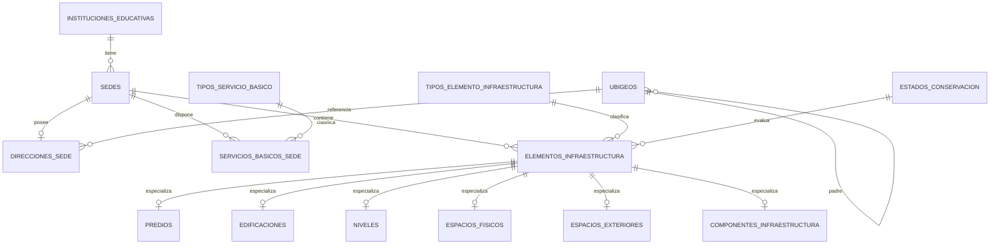

# Diagrama ER

```mermaid
erDiagram
  INSTITUCIONES_EDUCATIVAS ||--o{ SEDES : tiene
  SEDES ||--o| DIRECCIONES_SEDE : posee
  UBIGEOS ||--o{ UBIGEOS : padre
  UBIGEOS ||--o{ DIRECCIONES_SEDE : referencia
  SEDES ||--o{ SERVICIOS_BASICOS_SEDE : dispone
  TIPOS_SERVICIO_BASICO ||--o{ SERVICIOS_BASICOS_SEDE : clasifica
  SEDES ||--o{ ELEMENTOS_INFRAESTRUCTURA : contiene
  TIPOS_ELEMENTO_INFRAESTRUCTURA ||--o{ ELEMENTOS_INFRAESTRUCTURA : clasifica
  ESTADOS_CONSERVACION ||--o{ ELEMENTOS_INFRAESTRUCTURA : evalua
  ELEMENTOS_INFRAESTRUCTURA ||--o| PREDIOS : especializa
  ELEMENTOS_INFRAESTRUCTURA ||--o| EDIFICACIONES : especializa
  ELEMENTOS_INFRAESTRUCTURA ||--o| NIVELES : especializa
  ELEMENTOS_INFRAESTRUCTURA ||--o| ESPACIOS_FISICOS : especializa
  ELEMENTOS_INFRAESTRUCTURA ||--o| ESPACIOS_EXTERIORES : especializa
  ELEMENTOS_INFRAESTRUCTURA ||--o| COMPONENTES_INFRAESTRUCTURA : especializa
```
